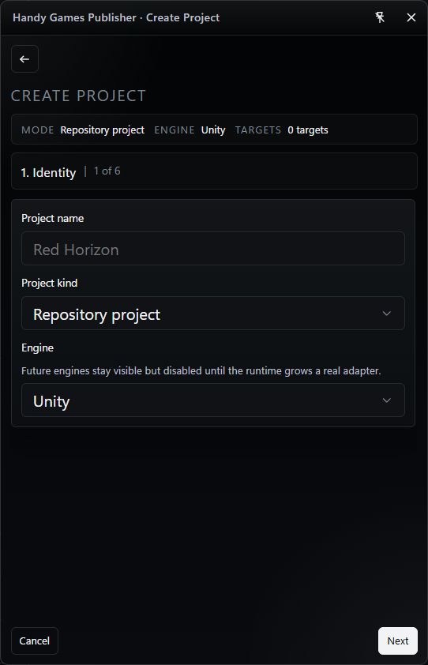
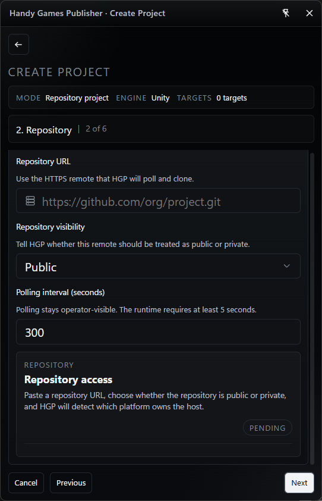
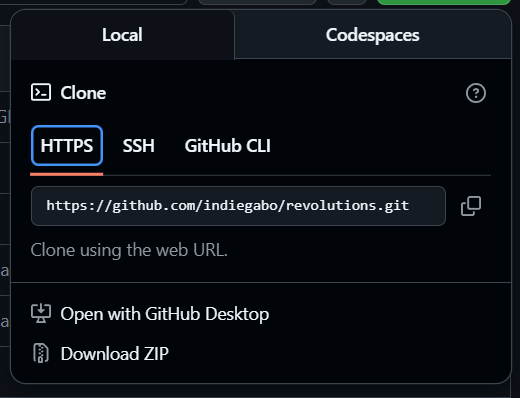
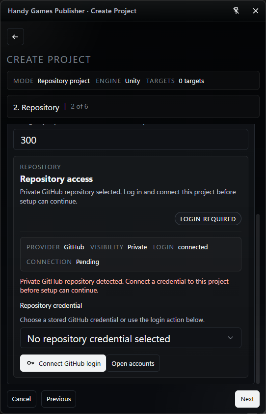
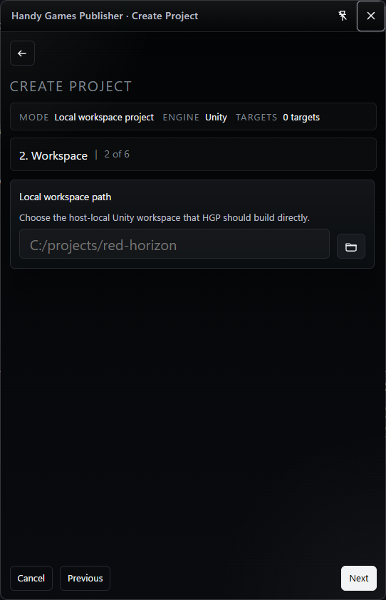
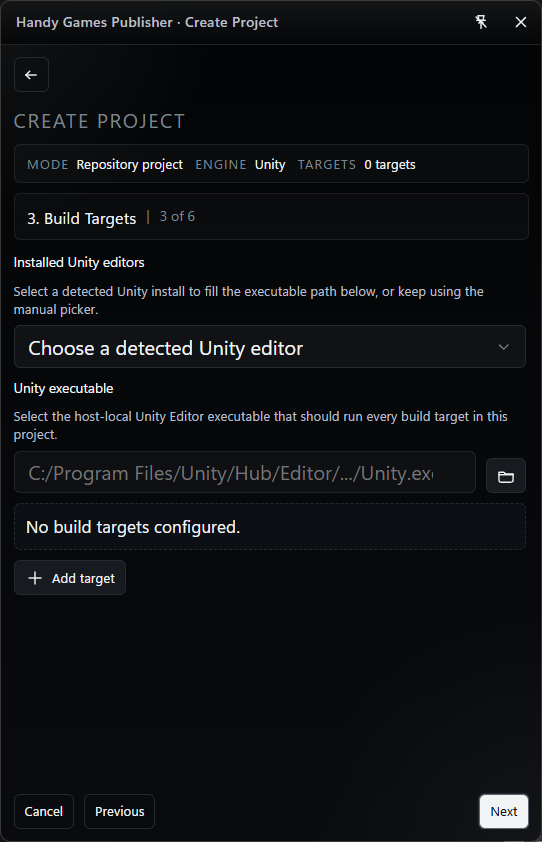
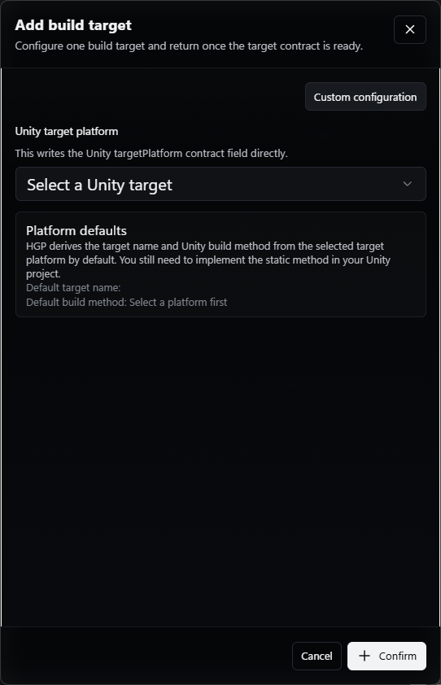
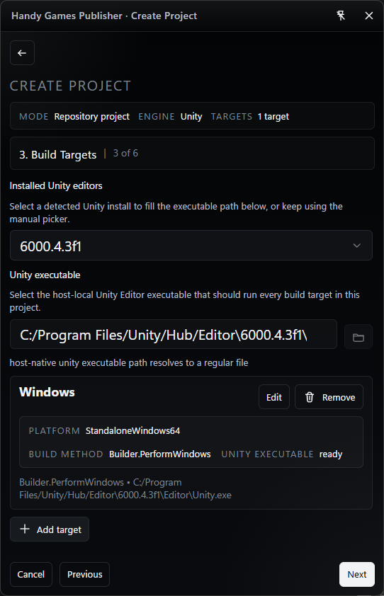

# Create Projects

Project creation is where you tell HGP what to watch, what to build, and where
successful outputs should go.

There are two types of projects:

##### Repository Project

A project that points to a remote Git repository. HGP fetches
source code from the repository and can trigger builds automatically via
polling or by responding to repository events such as release tags and
commits. Use this type for CI-like workflows and automated release
pipelines.

##### Local Workspace Project

A project that references a local filesystem workspace. HGP runs
builds against the files available on the operator's machine without
requiring a remote Git repository. This is useful for iterative
development, debugging, or when working with local-only projects.

## Project Creation Wizard

The creation wizard adapts fields, validation, and suggested defaults depending
on whether you choose a `Repository Project` or a `Local Workspace Project`.
Below are the per-step differences you will observe in the UI and behavior.

### Step 1: Define the project identity

Simple. Define a name, the project type and the engine. Unity is the only one
possible right now but we intend to work with other engines.

### Step 2: Connect the repository / Inform a working space

In the case you are creating a repository project you will have to inform basic stuff about
your repo. In case it is private, a github credentials vaulter will enter the scene.

_Example of what "Git URL" means_

Case your project is local based, just inform where it resides:

### Step 3: Add build targets

In this step you define for what platforms release processes will generate artifacts for. This step will react to the engine you choose. Since for now we can only use Unity, here is what you need to know:

You need to define a Unity Editor. The wizard will try locating Unity installs on your machine but you can specify one directly using the "Unity Executable" field.

Then you need to add one or more build targets that describe the deliverables for each platform. Each target typically includes at least: the platform you want to build for, the expected output kind (archive, directory, single file), and a build method name.

#### How platform selection and build method work

Choosing a platform tells HGP what kind of build this target should produce, such as a Windows desktop build or an Android package.

The build method is the entry point HGP asks your Unity project to run for that target. HGP suggests a standard method name for each platform so teams can follow a predictable convention, and in many cases that default is enough.

If your project uses a different naming scheme or separate build entry points, you can edit the method name for that specific target. Whatever name you keep here must match a build method that already exists in the Unity project for that platform.

See [Unity Builder Example](examples/unity-builder-example.md) for a sample script you can adapt in your Unity project.

This example is only a starting point. You are fully responsible for
implementing and maintaining the actual build logic for your project,
including platform-specific settings, extra build steps, signing,
output structure, and any other release requirements.

### Step 4: Configure publish destinations

- Repository Project: Publication options can be tied to automated flows
  (e.g., publish when a release tag is detected). The wizard surfaces
  trigger-based publishing options and artifact mapping that suit automated
  release pipelines.
- Local Workspace Project: Publication is treated as an operator-triggered
  action by default. The wizard focuses on local artifact retention and
  explicit publish steps rather than automated release hooks.

### Notes on credentials and automation

- Repository Project: May require SSH keys or access tokens; the wizard will
  surface credential entry and validation steps. Enabling polling or
  tag-triggered builds requires valid access to the repository.
- Local Workspace Project: Requires filesystem permissions for the chosen
  workspace and access to installed Unity editors; no remote credentials are
  required unless the operator opts to attach a remote Git URL later.

Next: read [Monitor Releases](releases-and-builds.md) to understand what you
will see once HGP starts processing work.
